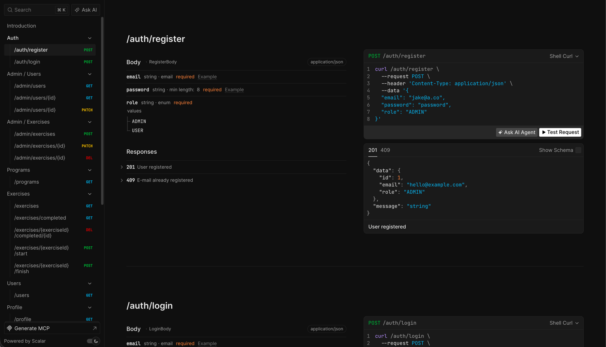
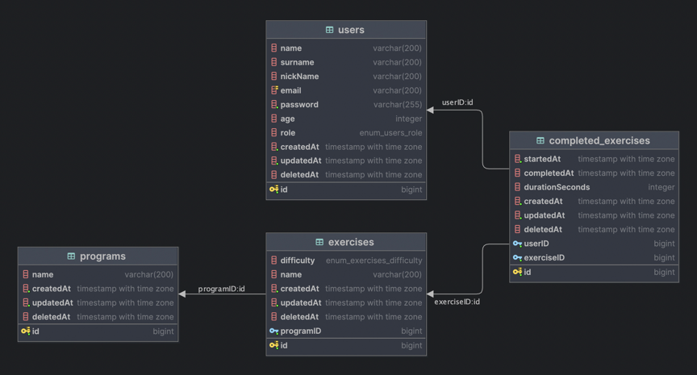

# Fitness app

👉 Assignment description moved to [ASSIGNMENT.md](ASSIGNMENT.md)

## How to start
1. `npm install`
2. create `.env` file (copy from `.env.example`)
3. `docker compose up -d`
4. `npm run seed`
5. `npm start`

## Interact with API
- See [/8000](http://localhost:8000/docs) for Scalar OpenAPI docs, or
- Visit [/openapi.json](http://localhost:8000/openapi.json) and take the schema anywhere

## Database schema

## Tech stack
The original assignment was extended by new packages, most notably:
- Passport for user authentication
- Zod for type-safe data validation
- Winston logger
- zod-to-openapi and Scalar for nice OpenAPI docs
- ESLint and prettier for code quality and formatting

## Assignment

- Completed all tasks
- Completed bonus task 1
    - For example `/exercises?page=1&limit=10&search=exercise&programId=1`
    - Open [local endpoint](http://localhost:8000/docs/#tag/exercises/GET/exercises)
- Completed bonus task 2
    - Check [src/utils/validate.ts](src/utils/validate.ts) for middleware validation
- Completed bonus task 4
    - Unified response format as per types in [api-response.ts](src/types/api-response.ts)
    - Check [error handler](src/utils/error-handler.ts) and [HttpError](src/utils/http-error.ts)
